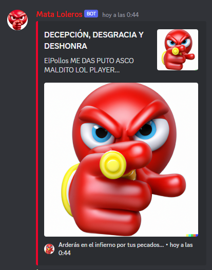
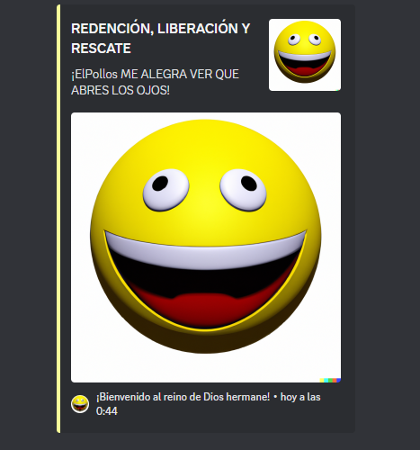
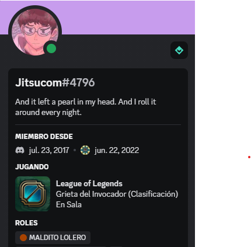

# League Of Legends Killer Bot

This is a bot that fulfills the function of identifying server users who start playing League of Legends and assigning them the role you want, in addition to sending a warning from the text channel.

## Features
 - Automatically detects when a user starts playing League of Legends and assigns a role to them.
 - Sends a message to a text channel to notify other users of the activity.
 - Configurable through a .env file that includes your Discord token, the ID of the role you want to assign, and the ID of the text channel where messages will be sent.  

  
## Messages  



## Role  

  
## Technologies

Some of the technologies used in this project are the following:

- Typescript
- Node
- DiscordJS


## Setup

In order to setup the project you need to have install node and pnpm:

 ```
   git clone https://github.com/victormhp/lol-players-killer.git
 ```
 ```
   cd lol-players-killer
 ```
 ```
   npm install
 ```


## Configuration
To configure the bot, you will need to create a .env file in the root directory of the project. You can use the .example.env file as a template:

```
DISCORD_TOKEN=<your Discord bot token>
ROLE_ID=<the ID of the role you want to assign>
CHANNEL_ID=<the ID of the text channel where messages will be sent>
```

**Note:** to obtain the IDs you must activate Discord's developer mode.


## Running the Bot
To start the bot, run the following command:

```
npm run start
```

By default, the bot will listen for messages on the same server it was invited to. If you want to change this behavior, you can modify the GUILD_ID variable in the .env file to match the ID of the server you want the bot to listen to.

## Stopping the Bot
To stop the bot, press Ctrl + C in the terminal where it is running.